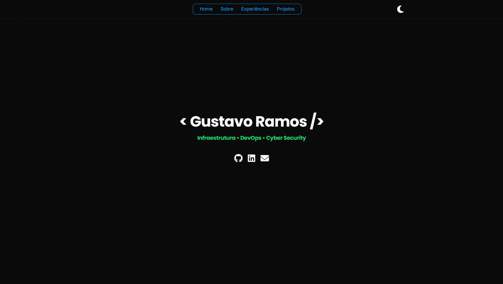
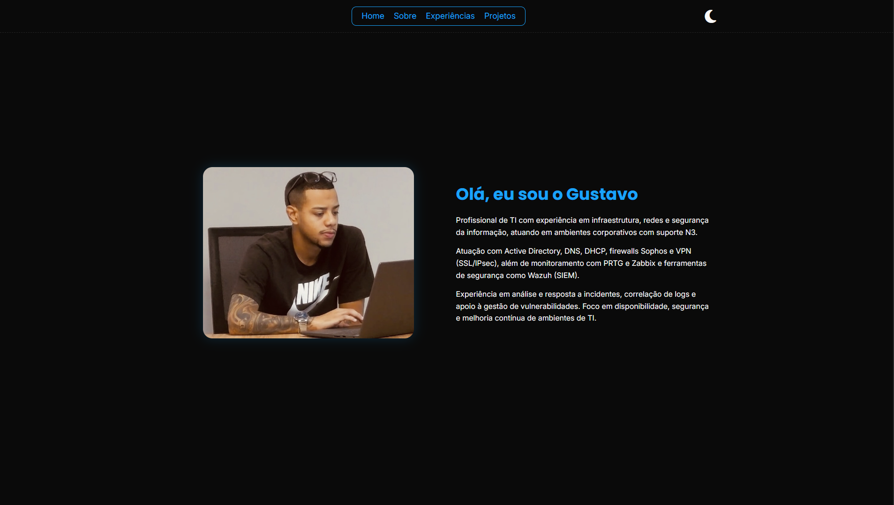
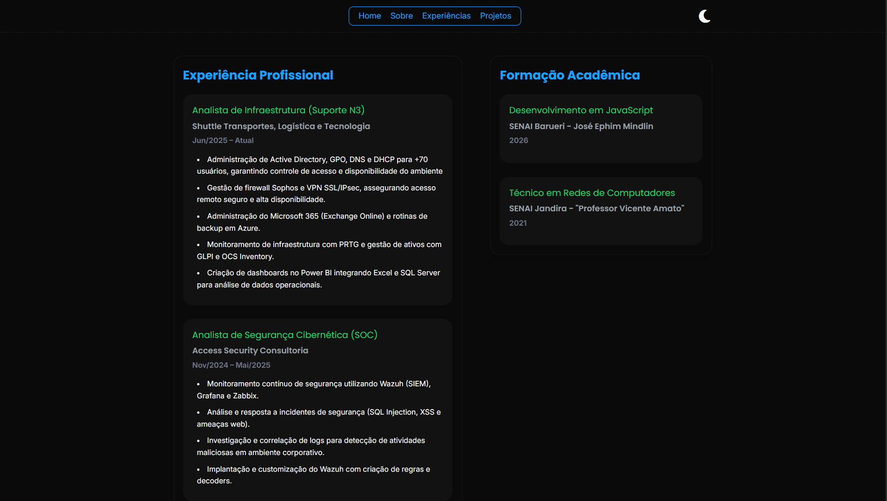
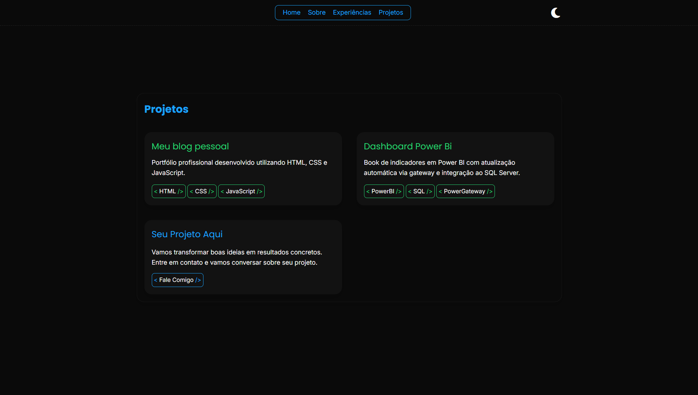
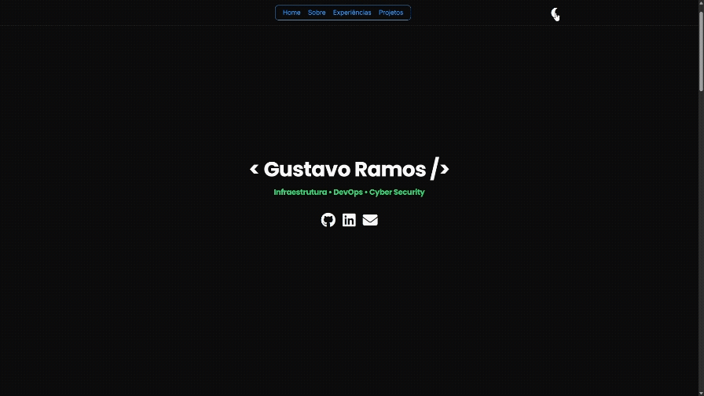
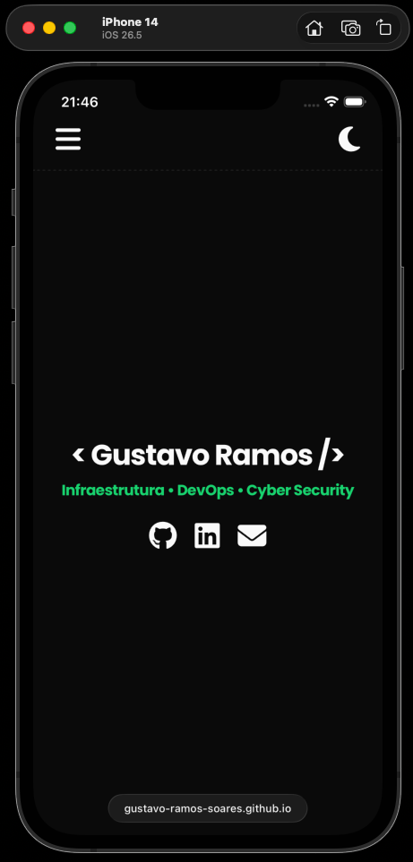

# Portfólio

Portfólio profissional desenvolvido com HTML, CSS e JavaScript, com suporte a tema claro/escuro e layout totalmente responsivo.

🔗 Acesse o projeto: https://gustavo-ramos-soares.github.io/portfolio/

---

## 🚀 Tecnologias utilizadas

- HTML5
- CSS3
- JavaScript
- Git
- GitHub Pages

---

## ✨ Funcionalidades

- Tema claro e escuro
- Layout totalmente responsivo
- Menu adaptado para dispositivos móveis
- Navegação suave entre seções
- Cards de projetos com links externos
- Organização das experiências profissionais e formação acadêmica

---

## Preview

### Home


### Sobre Mim


### Experiências


### Projetos


### Light/Dark Mode



### Responsividade

#### Versão Mobile



## 📂 Estrutura do projeto

```text
portfolio/
├── assets/
├── css/
├── js/
├── index.html
└── README.md
```

---

## 👨‍💻 Autor

**Gustavo Ramos Soares**

- LinkedIn: https://linkedin.com/in/gustavo-ramos-soares
- GitHub: https://github.com/gustavo-ramos-soares
- Portfólio: https://gustavo-ramos-soares.github.io/portfolio/
